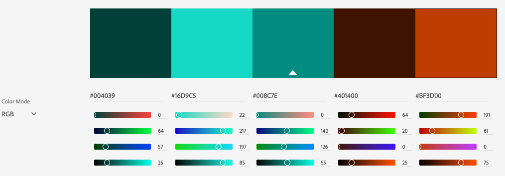
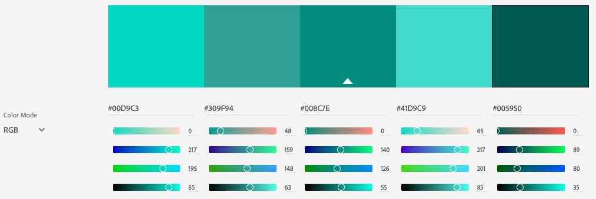

# Milestone 1 - Music School - by Kevin Bourke

This project is a small website for a Music School. The main purpose would be to get people interest in taking the music classes on offer from the music school. It promotes the positive benefits of learning music to help sell the classes. The website will display the various intruments that they teach as well as upcoming classes.
 
## UX

On some of the websites I looked as part of my research, it was not clear how you go about signing up for a course. For example, Dublin School of Music you have to go to the individual page for each instrument and it has it just written in plain text towards the bottom of a big paragraph of text : "For further information or to book a course of lessons, please phone us at 014929998", and The Music Room similarly just has text written at the bottom of Courses and Fees pages, and simply says "Please give us a call on 01 2965570 with any questions". 
For me this is bad user experience, you should really make your Call to Action or your users end goal as easy to find as possible. Ideally the path to sign up (or other CTA) should be almost instantly visible to the user. 

### User Stories
 
This section provides insight into the UX process, focusing on who this website is for, what it is that they want to achieve and how this project is the best way to help them achieve these things.

- As a user who is thinking about learning a musical instrument, I want to find out information that might convince me to take a class. The option of taking a free introductory class would be quite appealing. (image of free class)
- As a user who has already begun learning an instrument, perhaps I want to find some more formal training, to help me progress, or to add other related skills like reading music. (image of classes)
- As a user who might have children who are interested in music, I want to find out if these classes look appropriate, and where they take place. (image of Teachers, references to children, map)

### Strategy
There are 2 main goals of the website: 
 1. to get potential customers to sign up for a class, be it by applying for a term of classes or taking up the option of a free lesson to get a 'taster' for a class. This is probably the main goal.
 2. to give potential customers information about the music school to entice them to take a class in this school over competitors.

### Scope
This section determines what the users should be able to do on the website.
1. Sign up for a class.
2. Sign up for a free lesson as a sample.
3. Find out what music classes does the school do, and what cost.
4. Contact the music school for further information.
5. Find out where the music school is.

### Structure
At this point I started thinking about what information, pages, features, and calls to action were to necessary and how they would be grouped. I have included some basic sketching of ideas:
- [Initial ideas 01](https://github.com/Bourkekev/ms1-music-school/blob/master/sketch-wireframes/edited/initial-ideas.jpg)
    - These are initial ideas for the organisation of information and pages required, and sketching them down. It is rough and not very organised at this point.
- [Initial ideas 02](https://github.com/Bourkekev/ms1-music-school/blob/master/sketch-wireframes/edited/initial-ideas-02.jpg)
    - This is a bit more refined sketch of the information and order of the information, I would like on the pages. Below that there are just some quick sketches of the footer, contact page and an element for presenting a music class.

### Skeleton
At this point I began sketching proper wireframes, first on paper as it is quicker, helps to get the ideas out faster. I needed to think about how the User will navigate through the site, what content has priority, and how the content relates to each other. 
- [Home page on mobile, sketched wireframe](https://github.com/Bourkekev/ms1-music-school/blob/master/sketch-wireframes/edited/homepage-mobile.jpg)
    
- [Home page on desktop, sketched wireframe](https://github.com/Bourkekev/ms1-music-school/blob/master/sketch-wireframes/edited/homepage-desktop.jpg)
    
- [About page desktop, sketched wireframe](https://github.com/Bourkekev/ms1-music-school/blob/master/sketch-wireframes/edited/about-page-desktop.jpg)
    
- [Classes page desktop, sketched wireframe](https://github.com/Bourkekev/ms1-music-school/blob/master/sketch-wireframes/edited/classes-page-desktop.jpg)
    
This formed the basis of my final wireframes, which were created in Balsamiq:

- [Home page on mobile wireframe](https://github.com/Bourkekev/ms1-music-school/blob/master/wireframes/Music%20School%20homepage%20(mobile%20version).png)
    
- [Home page on desktop wireframe](https://github.com/Bourkekev/ms1-music-school/blob/master/wireframes/Music%20School%20homepage.png)
    
- [About page mobile wireframe](https://github.com/Bourkekev/ms1-music-school/blob/master/wireframes/About%20-%20Music%20school%20(mobile%20version).png)

- [About page desktop wireframe](https://github.com/Bourkekev/ms1-music-school/blob/master/wireframes/About%20-%20Music%20school.png)
    
- [Classes page mobile wireframe](https://github.com/Bourkekev/ms1-music-school/blob/master/wireframes/Classes%20and%20Fees%20(Mobile%20Version).png)

- [Classes page desktop wireframe](https://github.com/Bourkekev/ms1-music-school/blob/master/wireframes/Classes%20and%20Fees.png)

- [Contact page mobile wireframe](https://github.com/Bourkekev/ms1-music-school/blob/master/wireframes/Contact%20-%20Music%20School%20(Mobile%20version).png)

- [Contact page desktop wireframe](https://github.com/Bourkekev/ms1-music-school/blob/master/wireframes/Contact%20-%20Music%20School.png)

### Surface
This is the sensory design section of a website, or how it looks, feels and sounds. I wanted the design to be clean and the colour scheme to be light and refreshing. I decided on a pastel green as Green makes you feel optimistic and refreshed, and Green symbolizes health, new beginnings and wealth, according to [this article on 99 designs](https://99designs.ie/blog/tips/how-color-impacts-emotions-and-behaviors/). 

Also Spotify, currently the largest music streaming service in the world uses green in it's logo and designs, which likely represents freshness and vitality, something essential to a music brand. For reference see point 29 here - (https://piktochart.com/blog/inspirational-brand-colors/). However, I did not want it as vibrant or bright as the Spotify green, and leaning more toward the blue spectrum more like AirBnb.

    
 ** For more on how I chose the colour scheme expand this section ** 

    
As a starting point I took the green from the AirBnb colour scheme, but wanted it darker for the logo, as I felt it was a bit bright. Using illustrator I used brightness in the HSB color and darkened the colour by 10%. Then I put this colour (#008c7e) into [Adobe Color](https://color.adobe.com/create) and I wanted other colour options so chose Complementary, which would give me a contrasting colour. It also gave me a darker (#004039) and brighter green  (#16D9C5) colour. The complementary colour was an orangey-brown colour, though I felt the lighter one was a bit muddy looking so I increased the brightness by 20%. This was the final main colour scheme:

Also took the monochromatic variation in case I needed variations on the green:

I found that I needed another dark colour that would work for text on the lighter green becuase the complementory orange colour was quite a start contrast that I did not like. I liked the pastel navy colour that appeared on the Form + Function website because it worked well with their green colour. However I found it was too light and darkened it by 5% to get #3d5671. I checked it against the light green using the colour contrast on [Webaim Contrast Checker](https://webaim.org/resources/contrastchecker/) and it passed the WCAG AA standard for large text. This would be ok as this dark navy text would be quite large and bold.

#### Language/Tone
I wanted the __language__ to be casual and conversational, and not jargony or too technical.

## Technologies Used

1. HTML
2. CSS
3. Bootstrap CSS Framework
4. Font Awesome
5. Google Fonts

Where possible, I tried to use classes that are built into a technology such as Bootstrap (like mb-lg-5) or Font Awesome (like fa-3x).

- [JQuery](https://jquery.com)
    - The project uses **JQuery** to simplify DOM manipulation.

## Features

In this section, you should go over the different parts of your project, and describe each in a sentence or so.

### Expand the sections below for more info on details

  
Creating navbar X to close

  
  To create the X that appears when the navbar is open, I first created an svg file from the bootstrap svg that was embedded as data:image. I edited this with Illustrator to create the X and then I had to copy the stroke styles for the path from the bootstrap svg so it was visible. 
  Then i added the class 'collapsed' to the button.navbar-toggler element in the HTML, so it has this class by default on load (usually only added upon clicking  menu toggle the first time). I overrode the default background images for the toggle icon, and changed the image when the toggler does not have the class 'collapsed' on it.

 
### Existing Features
- Feature 1 - allows users contact the school, by having them fill out the contact form.
- 

#### Minor Features
 - There is a 'Skip to main content' link just inside the body tag for accessibility for screenreaders. The main content is not usually the first thing on a web page. Keyboard and screen reader users generally must navigate a long list of navigation links, sub-lists of links, corporate icons, site searches, and other elements before ever arriving at the main content. This is then hidden from view with the bootstrap class 'sr-only', however when it receives focus from keyboard it becomes visible, by basically reversing the Bootstrap CSS properties on focus. This is based on accessibility recommendations from https://webaim.org/techniques/skipnav/

For some/all of your features, you may choose to reference the specific project files that implement them, although this is entirely optional.

##### Form Labels
I am not a fan of form labels appearing above the input, but they are important for accessibility, for screen-readers and the like. Placeholder text within the input alone is not good enough. Some techniques simply hide the label visually, but are still readable by screen-readers by setting a tiny height and clipping the element. However I have seen forms where the placeholder text moves up when you click inside (or focus on) the input, such as Aer Lingus and LinkedIn. This placeholder text is actually the label and is just positioned over the input and moved when the input is focused on. Bootstrap has an experimental version of this but it relies on ::placeholder-shown, which is more supported now in latest browsers, but still unsupported in some older browser versions like Edge, IOS Safari and Android.

In addition, you may also use this section to discuss plans for additional features to be implemented in the future:

### Features Left to Implement
- Another feature idea

## Testing

In this section, you need to convince the assessor that you have conducted enough testing to legitimately believe that the site works well. Essentially, in this part you will want to go over all of your user stories from the UX section and ensure that they all work as intended, with the project providing an easy and straightforward way for the users to achieve their goals.

Whenever it is feasible, prefer to automate your tests, and if you've done so, provide a brief explanation of your approach, link to the test file(s) and explain how to run them.

For any scenarios that have not been automated, test the user stories manually and provide as much detail as is relevant. A particularly useful form for describing your testing process is via scenarios, such as:

1. Responsive carousel images:
    1. To allow me to use a different image in the carousel for mobile I used the `<picture>` element. This allowed me to create a smaller portrait image just for a mobile, which gave more space for the carousel text that is layered on top.
    
2. Contact form:
    1. Go to the "Contact Us" page
    2. Try to submit the empty form and verify that an error message about the required fields appears
    3. Try to submit the form with an invalid email address and verify that a relevant error message appears
    4. Try to submit the form with all inputs valid and verify that a success message appears.

In addition, you should mention in this section how your project looks and works on different browsers and screen sizes.

You should also mention in this section any interesting bugs or problems you discovered during your testing, even if you haven't addressed them yet.

If this section grows too long, you may want to split it off into a separate file and link to it from here.

## Deployment

This site is hosted using GitHub pages, deployed directly from the master branch. The deployed site will update automatically upon new commits to the master branch. In order for the site to deploy correctly on GitHub pages, the landing page must be named `index.html`.

In addition, if it is not obvious, you should also describe how to run your code locally.

## Issues I had to overcome
When using an image in the Bootstrap card (for Our Teachers), and I applied padding to the image, it caused the image to get squashed horizontally a bit. This was to do with Bootstrap using `display:flex; and flex-direction:column;` on the card. To correct this I wrapped the image in a div, so it was not getting affected directly. 

## Credits

For generating browser prefixes - [Autoprefixer for CSS](https://autoprefixer.github.io/)

### Content
- The text for the Quotes section were taken from the [CMuse article ](https://www.cmuse.org/100-famous-and-inspirational-music-quotes/)
- 

### Media
- The photos and vectors used in this site were obtained from:
    - https://pixabay.com/
    - https://www.vecteezy.com/
    - https://unsplash.com/
- The favicons were generated at https://realfavicongenerator.net/

### Acknowledgements

- I received inspiration for this project from X
