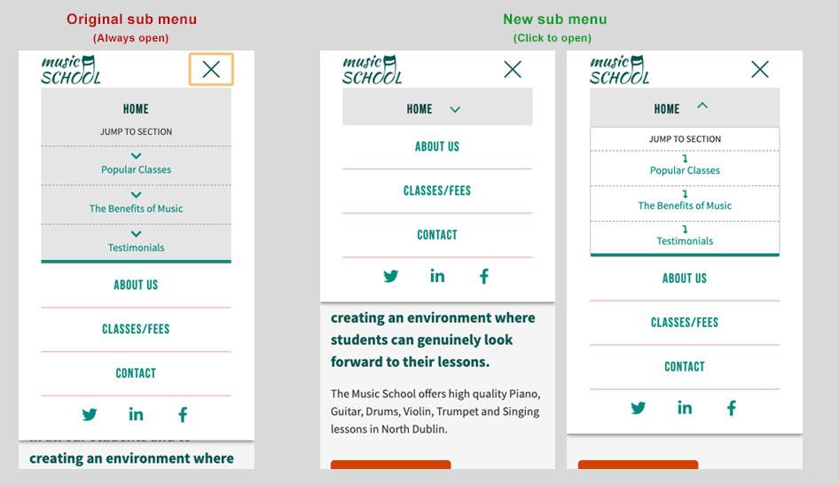

# Milestone 1 - Music School - by Kevin Bourke

This project is a small website for a Music School. The main purpose would be to get people interest in taking the music classes on offer from the music school. It promotes the positive benefits of learning music to help sell the classes. The website will display the various intruments that they teach as well as upcoming classes.
 
## UX

On some of the websites I looked as part of my research, it was not clear how you go about signing up for a course. For example, Dublin School of Music you have to go to the individual page for each instrument and it has it just written in plain text towards the bottom of a big paragraph of text : "For further information or to book a course of lessons, please phone us at 014929998", and The Music Room similarly just has text written at the bottom of Courses and Fees pages, and simply says "Please give us a call on 01 2965570 with any questions". 
For me this is bad user experience, you should really make your Call to Action or your users end goal as easy to find as possible. Ideally the path to sign up (or other CTA) should be almost instantly visible to the user. 

### User Stories
 
This section provides insight into the UX process, focusing on who this website is for, what it is that they want to achieve and how this project is the best way to help them achieve these things.

- As a user who is thinking about learning a musical instrument, I want to find out information that might convince me to take a class. The option of taking a free introductory class would be quite appealing.
- As a user who has already begun learning an instrument, perhaps I want to find some more formal training, to help me progress, or to add other related skills like reading music.
- As a user who might have children who are interested in music, I want to find out if these classes look appropriate, who the teachers are and where they take place.

### Strategy
There are 2 main goals of the website: 
 1. to get potential customers to sign up for a class, be it by applying for a term of classes or taking up the option of a free lesson to get a 'taster' for a class. This is probably the main goal.
 2. to give potential customers information about the music school to entice them to take a class in this school over competitors.

### Scope
This section determines what the users should be able to do on the website.
1. Enquire about signing up for a class.
2. Enquire about signing up for a free lesson as a sample.
3. Find out what music classes the school does, and what cost.
4. Contact the music school for further information.
5. Find out where the music school is.
6. Find out more information about the school and its teachers.

### Structure
At this point I started thinking about what information, pages, features, and calls to action were to necessary and how they would be grouped. I have included some basic sketching of ideas:
- [Initial ideas 01](https://github.com/Bourkekev/ms1-music-school/blob/master/sketch-wireframes/initial-ideas.jpg)
    - These are initial ideas for the organisation of information and pages required, and sketching them down. It is rough and not very organised at this point.
- [Initial ideas 02](https://github.com/Bourkekev/ms1-music-school/blob/master/sketch-wireframes/initial-ideas-02.jpg)
    - This is a bit more refined sketch of the information and order of the information, I would like on the pages. Below that there are just some quick sketches of the footer, contact page and an element for presenting a music class.

### Skeleton
At this point I began sketching proper wireframes, first on paper as it is quicker, helps to get the ideas out faster. I needed to think about how the User will navigate through the site, what content has priority, and how the content relates to each other. 
- [Home page on mobile, sketched wireframe](https://github.com/Bourkekev/ms1-music-school/blob/master/sketch-wireframes/homepage-mobile.jpg)
    
- [Home page on desktop, sketched wireframe](https://github.com/Bourkekev/ms1-music-school/blob/master/sketch-wireframes/homepage-desktop.jpg)
    
- [About page desktop, sketched wireframe](https://github.com/Bourkekev/ms1-music-school/blob/master/sketch-wireframes/about-page-desktop.jpg)
    
- [Classes page desktop, sketched wireframe](https://github.com/Bourkekev/ms1-music-school/blob/master/sketch-wireframes/classes-page-desktop.jpg)
    
This formed the basis of my final wireframes, which were created in Balsamiq:

- [Home page on mobile wireframe](https://github.com/Bourkekev/ms1-music-school/blob/master/wireframes/music-school-homepage-mobile-version.png)
    
- [Home page on desktop wireframe](https://github.com/Bourkekev/ms1-music-school/blob/master/wireframes/music-school-homepage.png)
    
- [About page mobile wireframe](https://github.com/Bourkekev/ms1-music-school/blob/master/wireframes/about-music-school-mobile-version.png)

- [About page desktop wireframe](https://github.com/Bourkekev/ms1-music-school/blob/master/wireframes/about-music-school.png)
    
- [Classes page mobile wireframe](https://github.com/Bourkekev/ms1-music-school/blob/master/wireframes/classes-and-fees-mobile-version.png)

- [Classes page desktop wireframe](https://github.com/Bourkekev/ms1-music-school/blob/master/wireframes/classes-and-fees.png)

- [Contact page mobile wireframe](https://github.com/Bourkekev/ms1-music-school/blob/master/wireframes/contact-music-school-mobile-version.png)

- [Contact page desktop wireframe](https://github.com/Bourkekev/ms1-music-school/blob/master/wireframes/contact-music-school.png)

### Surface
This is the sensory design section of a website, or how it looks, feels and sounds. I wanted the design to be clean and the colour scheme to be light and refreshing. I created a moodboard with Adobe Spark from research of colours, styles and components to visually illustrate the style I wished to pursue. You can see that [moodboard here.](https://github.com/Bourkekev/ms1-music-school/blob/master/design/ms1-moodboard.jpg)

I decided on a pastel green as Green makes you feel optimistic and refreshed, and Green symbolizes health, new beginnings and wealth, according to [this article on 99 designs](https://99designs.ie/blog/tips/how-color-impacts-emotions-and-behaviors/). This would be my primary colour.

Also Spotify, currently the largest music streaming service in the world uses green in it's logo and designs, which likely represents freshness and vitality, something essential to a music brand. For reference see point 29 and 30 here - (https://piktochart.com/blog/inspirational-brand-colors/). However, I did not want it as vibrant or bright as the Spotify green, and leaning more toward the blue spectrum more like AirBnb.

    
<strong>For more on how I chose the colour scheme expand this section</strong>

As a starting point I took the green from the AirBnb colour scheme, but wanted it darker for the logo, as I felt it was a bit bright. Using Illustrator I used brightness in the HSB color and darkened the colour by 10%. Then I put this colour (#008c7e) into [Adobe Color](https://color.adobe.com/create) and I wanted other colour options so chose Complementary, which would give me a contrasting colour. It also gave me a darker (#004039) and brighter green  (#16D9C5) colour. The complementary colour was an orangey-brown colour, though I felt the lighter one was a bit muddy looking so I increased the brightness by 20%. This would be my secondary colour. This was the final main colour scheme (P.S. see note below where I changed secondary colour slightly):

Also took the monochromatic variation in case I needed variations on the green:

I later found that I needed another dark colour that would work for text on the lighter green because white would not provide enough contrast and the complementory orange colour was quite a stark contrast that I did not like. During my research, I liked the pastel navy colour that appeared on a website I liked (that used green), [Form + Function website](https://www.formandfunctionagency.com/) because it worked well with their green colour. However I found it was too light and darkened it by 5% to get #3d5671. I checked it against the light green using the colour contrast on [Webaim Contrast Checker](https://webaim.org/resources/contrastchecker/) and it passed the WCAG AA standard for large text. This would be ok as this dark navy text would be quite large and bold.

Towards the end of the project and having seen it in place, I felt that the secondary colour was too dark and drab, a bit depressing. So I decided I would brighten this colour by 5 percent (in HSL colour). This was the colour used for buttons so it needed to work with white text. I checked the colour again with WebAim Contrast Checker and it would fail at that brightness. I checked the colour when only brightened by 4% and it passed the colour check to WCAG AA standard. So my secondary colour #bf3d00 became #d14200.

#### Language/Tone
I wanted the __language__ to be casual and conversational, and not jargony or too technical.

#### Styling considerations

Before beginning development, I listed some styling ideas that I felt would enhance the feel of the site and give a professional touch, which I may want to incorporate. Not all of these were used in the final website.

 - CSS reset - Bootstrap already contains reboot css file for this.
 - Favicons
 - Small line above or below nav hover/active state. Uses `:before`
 - 2 corner border on images, based off a [codepen](https://codepen.io/AZGSKULL/pen/XzLjLE) that I saw, which uses multiple box-shadows.
 - Restyle Form select element with just CSS
 - Determine what happens when submit form. Won't submit but give feedback.
 - Sticky Navigation
 - Simple transitions on hover states
 - Bootstrap classes (like hide on mobile) and other features.
 - Make nav hamburger an X on open. 
 - Place one add-on or button on either side of a form input [from bootstrap](https://getbootstrap.com/docs/4.4/components/input-group/)
 - Different Icons - https://getbootstrap.com/docs/4.4/extend/icons/
 - Mobile Nav in from side
 - Move form label on focus, or hide label accessibly. E.g linkedin, aerlingus, also see https://getbootstrap.com/docs/4.4/examples/floating-labels/ 
 - Parallax background - https://www.w3schools.com/howto/howto_css_parallax.asp 
 - Video? Background - https://www.wonder-vision.com/

## Technologies Used

1. HTML
2. CSS
3. Bootstrap CSS Framework
4. Font Awesome
5. Google Fonts
6. Javascript - Minor uses of Javascript for enhancing the user experience.
7. TinyPNG - To keep transparent png sizes to a minimum I used the online png compressing service [TinyPNG](https://tinypng.com/)
7. [JQuery](https://jquery.com) - The project uses **JQuery** to simplify DOM manipulation. I used a very small jQuery script (global.js) to close the navbar when a sub menu item is clicked, because the sub menu items are only used for links to anchor points in the homepage.
    
Where possible, I tried to use classes that are built into a technology such as Bootstrap (like mb-lg-5) or Font Awesome (like fa-3x).

## Features
 
### Existing Features
This section describes how users can achieve what they need to when viewing the site.
- **View upcoming classes** - allows users to see dates and days for upcoming classes and cost.
- **View the staff** - Allows users to view the teachers and get a small pice of information about their qualifications/experience.
- **Find the school location** - the contact page gives the address and contact details of the school as well as a map so users can quickly see where the school is located.
- **Contact the school** - allows users contact the school, by having them fill out the contact form. The form does not work yet as there is no server side script to send the information. I have used the Bootstrap modal (from the documentation) to pop-up when the user clicks the button, so it will at least give some feedback and also demonstrate the Bootstrap modal pop-up.
- **Find about previous students experiences** - the user can view some testimonials from previous students.
- **Follow the school on social media** - users can find the social media profiles of the school.
- **Enquire about music classes** - allows users enquire about specific instrument classes, by having them fill out the equiry form on the classes page. 
- **Enquire about trying a free class** - allows users enquire about trying out the free class offer, by having them fill out the equiry form on the classes page. The button on the homepage links to this form.
- **

#### Minor Features
Expand the sections below for more info on details

  
<strong>Creating navbar X to close</strong>

  
  To create the X that appears when the navbar is open, I first created an svg file from the bootstrap svg that was embedded as data:image. I edited this with Illustrator to create the X and then I had to copy the stroke styles for the path from the bootstrap svg so it was visible. 
  Then i added the class 'collapsed' to the button.navbar-toggler element in the HTML, so it has this class by default on load (usually only added upon clicking  menu toggle the first time). I overrode the default background images for the toggle icon, and changed the image when the toggler does not have the class 'collapsed' on it.

  
<strong>Auto select instrument checkbox on click 'Enquire' button</strong>

 When a user clicks the 'Enquire' button beside a specific class on the classes page, they will be brought to the Enquiry form below and the checkbox for that specific instrument will be selected. I used a small javascript onclick function to achieve this, based off a question on [Stack Overflow](https://stackoverflow.com/questions/25763800/check-checkbox-by-clicking-button)
 

  
<strong>Skip to main content</strong>

 There is a 'Skip to main content' link just inside the body tag for accessibility for screenreaders. The main content is not usually the first thing on a web page. Keyboard and screen reader users generally must navigate a long list of navigation links, sub-lists of links, corporate icons, site searches, and other elements before ever arriving at the main content. This is then hidden from view with the bootstrap class 'sr-only', however when it receives focus from keyboard it becomes visible, by basically reversing the Bootstrap CSS properties on focus. This is based on accessibility recommendations from https://webaim.org/techniques/skipnav/. This can be checked by pressing tab when a pages loads.
 

  
<strong>'Jump to section' for mobile</strong>

I added a 'Jump to section' for mobile on the homepage. As a dropdown under Home I added links to sections of teh homepage, to help minimise scrolling. To get a nice scroll to the anchor points wihin then homepage, I used the css scroll-behaviour property based off [CSS Tricks](https://css-tricks.com/almanac/properties/s/scroll-behavior/). This property is not fully supported, particularly on Safari (both Mac and iPhone), but it will degrade gracefully and still jump top the anchor point on those devices.

  
<strong>Form Labels</strong>

I am not a fan of form labels appearing above the input, but they are important for accessibility, for screen-readers and the like. Placeholder text within the input alone is not good enough. Some techniques just use placeholder text and simply hide the label visually, but are still readable by screen-readers by setting a tiny height and clipping the element. This is fine but the placeholder text disappears once the field receives some input. So looking back over a somewhat long form can make it difficult to know what each form field was for. However I have seen forms where the placeholder text moves up when you click inside (or focus on) the input, such as Aer Lingus and LinkedIn. This placeholder text is actually the label and is just positioned over the input and moved when the input is focused on, and stays if there is valid content in the input. Bootstrap has an experimental version of this but it relies on ::placeholder-shown, which is more supported now in latest browsers, but still unsupported in some older browser versions like Edge, IOS Safari and Android. The downside is that you cannot use placeholder text for additional information. 

### Features to consider implementing in the future
 - Social Media feed, Instagram, Twitter
 - Online booking or payment for a class
 - Pages about each instrument
 - Blog or Latest News
 - Video(s) of students playing instruments

## Testing

In this section, you need to convince the assessor that you have conducted enough testing to legitimately believe that the site works well. Essentially, in this part you will want to go over all of your user stories from the UX section and ensure that they all work as intended, with the project providing an easy and straightforward way for the users to achieve their goals.

Whenever it is feasible, prefer to automate your tests, and if you've done so, provide a brief explanation of your approach, link to the test file(s) and explain how to run them.

### Validation

#### HTML
I validated the HTML with the [W3 Validation Service](https://validator.w3.org/). There was a warning about lack of a heading inside the first section on the about page. This section contains just some quick statistics about the school (130+ students etc...), but I do not want a heading here, so I decided I could leave this as is because it was just a warning.

The forms' option fields reported as an error (even though it worked) at first because the select field is required, yet has an initial value from the first option field. If an option is initially selected due to the attribute, then the select control always has a value. Unless that value is set to the empty string there is no point in using the attribute required. So the fix is to add an empty value to the first option.

An error showed up with regards to the modal's aria-labelled attribute which was not referencing the correct element, on the contact and classes page. This was fixed.

Validation also warned of missing image alt tags and said the pipe character that Google fonts uses to separate fonts wa in valid, so I changed it to the encoding required for a url - %7c, which ironically how Google says to encode it on https://developers.google.com/maps/documentation/urls/url-encoding

#### CSS

I validated the CSS with the [W3 CSS Validation Service](http://www.css-validator.org/) for CSS Level 3 and it found no errors. 

### Testing on Browsers, Screen sizes and Devices
I tested the website on the following browsers and devices:
- Chrome on PC and Mac
- Firefox on PC and Mac
- Safari on Mac
- Microsoft Edge V44
- Microsoft Internet Explorer V11
- Chrome on Samsung Galaxy S8, Android V9
- Firefox on Samsung Galaxy S8
- Native Browser on Samsung Galaxy S8
- Chrome on Lenovo 10" Tablet, Android V6

On all of the above the site worked fine as expected, except for some minor issues on IE11. Under the Teacher images there was a large space before their name. This was to do with the extra div I added to correct the images being squashed (see the section on Issues I had to overcome). This was easily fixed by giving the div an explicit height of 100%. Also, as I expected the CSS scroll-behaviour property would not work on IE11, Edge or Safari.

Testing other devices - I ran the website through [Browser Stack](https://www.browserstack.com/) on a free account to test on real devices and screen sizes. I was able to live test the following devices:
 - Samsung Galaxy Tab, Chrome, 4, 10.1 in - 5.4 x 8.6in, Resolution 1280 x 800px
 - iPhone 6S, Safari, 4.7 in - 2.3 x 4.1 in, Resolution 750 x 1334px, Viewport 375 x 667 dp
 - iPad Air 2, iOS v8, Safari, Resolution 9.7 in - 5.8 x 7.8in, Viewport 768 x 1024 dp
 
They worked fine apart from iPad Air 2, which seemed to break the Bootstrap grid. Some research indicated that the CSS flex property was not supported on iOS v8. Considering iOS 8 was out in 2014, this is probably not much of an issue now. Apple would usually push updated to devices over the years. Ref - https://github.com/twbs/bootstrap/issues/24012

For any scenarios that have not been automated, test the user stories manually and provide as much detail as is relevant. A particularly useful form for describing your testing process is via scenarios, such as:

1. Responsive carousel images:
    1. To allow me to use a different image in the carousel for mobile I used the `<picture>` element. This allowed me to create a smaller portrait image just for a mobile, which gave more space for the carousel text that is layered on top.
    
2. Contact form:
    1. Go to the "Contact Us" page
    2. Try to submit the empty form and verify that an error message about the required fields appears
    3. Try to submit the form with an invalid email address and verify that a relevant error message appears
    4. Try to submit the form with all inputs valid and verify that a success message appears.

In addition, you should mention in this section how your project looks and works on different browsers and screen sizes.

You should also mention in this section any interesting bugs or problems you discovered during your testing, even if you haven't addressed them yet.

If this section grows too long, you may want to split it off into a separate file and link to it from here.

## Deployment

This site is hosted using GitHub pages, deployed directly from the master branch. The deployed site will update automatically upon new commits to the master branch. In order for the site to deploy correctly on GitHub pages, the landing page must be named `index.html`.

To run locally, you can clone this repository directly into the editor of your choice by pasting `git clone https://github.com/Bourkekev/ms1-music-school.git` into your terminal. To cut ties with this GitHub repository, type `git remote rm origin` into the terminal.

## Issues I had to overcome
 - When using an image in the Bootstrap card (for Our Teachers), and I applied padding to the image, it caused the image to get squashed horizontally a bit. This was to do with Bootstrap using `display:flex; and flex-direction:column;` on the card. To correct this I wrapped the image in a div, so it was not getting affected directly. 
 

 - I used a [Favicon Generator](https://realfavicongenerator.net/) to create my favicons which generates many variations for different browsers and devices. It recommends to put these into the website root and some html to put into your page head, but I found on GitHub Pages this did not work. It seems it was looking for the favicon in my account root rather than the project root, so I would need to change the path. So while doing this it made sense to clean up my root folder as the generator created 10 files to put in the root.
 

 - On a lot of mobile's, iPhone's and iPad's Safari browser the fixed background does not work, so I have it only set to fix on screen sizes from 992px and bigger.
 

 - My mentor suggested anchor links for the homepage on the mobile navigation, so users could jump to section on the homepage if it otherwise required a lot of scrolling. I would normally not have a dropdown under Home, and when I applied the default bootstrap dropdown, it disabled the home link. Obviously I could not have a home link that did not work so was originally going to have the sub-menu but leave it open. But I was not happy with this either as I feared it would not be obvious that these were links to sections on the homepage, as it looked overly complicated, and test users said the same. So I decided to put a new link beside home that would act as the dropdown toggle. This is more obvious now and cleans up the mobile navigation. See the following image for comparison:

 - On mobile, the sub-menu anchor links to the sections in my homepage worked but by default leaves the navbar open so it covers most of the screen. This is not great usability, so I looked for a simple jQuery script that would close the navbar when the anchor links are clicked.
 
## Credits

### Design and Research

The following sites are websites that I used for reference and inspiration:
 - https://solfeggio.cmsmasters.net/contacts/
 - http://www.churchtownschoolofmusic.ie/
 - http://www.themusicroom.ie/
 - https://portmarnockschoolofmusic.com/ 
 - http://www.msom.ie/ 
 - http://www.ncdms.ie/ 
 - https://www.dublinschoolofmusic.com/
 - [Colour and emotions](https://99designs.ie/blog/tips/how-color-impacts-emotions-and-behaviors/)
 - [Nice clean colour scheme with greens and orange](https://www.formandfunctionagency.com/)
 - [Our People cards](https://venngage.com/blog/presentation-layout-ideas/)
 - Event Lists - https://www.youtube.com/watch?v=W9hnAVLgZ_g&t=493s, https://wpeventsplus.com/events-list/ and https://demo.myeventon.com/

### Technical

 - For generating browser prefixes - [Autoprefixer for CSS](https://autoprefixer.github.io/)

 - The border gradient on the About page under the school stats was inspired by this article on [loxodrome](https://www.loxodrome.io/post/gradient-borders/) and also on [CSS-Tricks](https://css-tricks.com/gradient-borders-in-css/).

 - I found a way to close the navbar when an anchor point is clicked using jQuery on this [stackoverflow page](https://stackoverflow.com/questions/42401606/how-to-hide-collapsible-bootstrap-4-navbar-on-click).

 - How to replace the Bootstrap dropdown caret icon based on this [Stack Overflow question.](https://stackoverflow.com/questions/54396053/how-to-replace-bootstrap-dropdown-toggle-icon-with-another-default-icon)

 - When a user clicks the 'Enquire' button beside a specific class on the classes page, they will be brought to the Enquiry form below and the checkbox for that specific instrument will be selected. The javascript onclick function to achieve this, based off a question on [Stack Overflow.](https://stackoverflow.com/questions/25763800/check-checkbox-by-clicking-button)

### Content
 - The text for the music Quotes were taken from the [CMuse article.](https://www.cmuse.org/100-famous-and-inspirational-music-quotes/)
 - The classes written content and teachers information was adapted from [Dublin School of Music.](http://dublinschoolofmusic.ie/)
 - Testimonials were adapted from [North County Dublin Music School](http://www.ncdms.ie/) and [Dublin School of Music.](http://dublinschoolofmusic.ie/)
 - The Benefits of music were taken from [Benefits of Learning Music article.](https://www.parents.com/kids/development/intellectual/6-benefits-of-music-lessons)
 - About school content adapted from http://www.churchtownschoolofmusic.ie/ and http://www.themusicroom.ie/

### Media
- The photos and vectors (except logo) used in this site were obtained from:
    - https://pixabay.com/
    - https://www.vecteezy.com/
    - https://unsplash.com/
- The favicons were generated at https://realfavicongenerator.net/
- I designed the logo myself, by just adapting a script font

### Acknowledgements

- Thanks to my mentor Anthony Ngene for his suggestions and his time.
- TO FINISH Thanks to those on Slack for reviewing my project.
